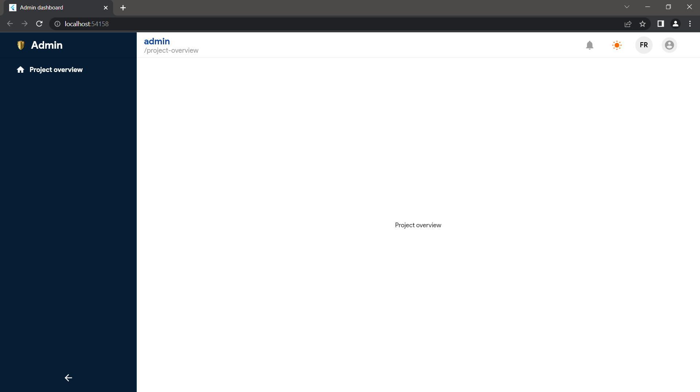
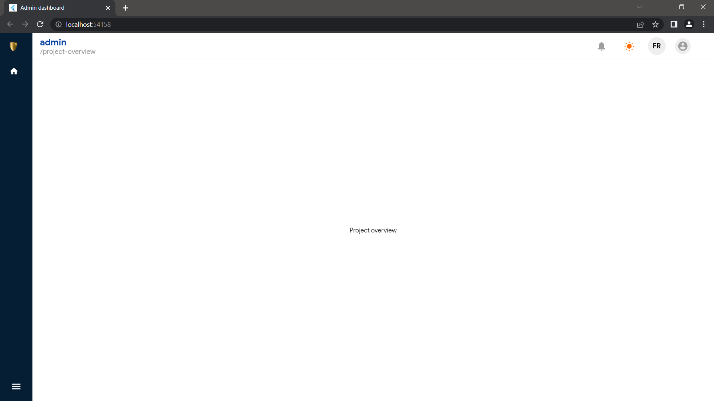

# Admin Dashboard Template

🚀 A beautiful and responsive admin dashboard template built with Flutter and Dart.

## Features

🎨 Beautiful and modern UI design \
📱 Responsive layout \
📊 Data visualization charts \
🔒 Authentication and authorization \
🔍 Search functionality \
🔔 Notifications \
📆 Calendar integration \
📧 Email integration \
🔍 SEO friendly \
🚀 Fast and smooth performance 

## Getting Started

1. Clone the repository
2. Install dependencies with `flutter pub get`
3. Run the app with `flutter run`

## Screenshots

📷 Screenshots of the dashboard:

## Contributions

🙌 Contributions are always welcome! Please see the [contribution guidelines](/CONTRIBUTING.md) for more information.

## License

📝 This project is licensed under the MIT License - see the [LICENSE](/LICENSE) file for details.
# Admin Dashboard Template

🚀 A beautiful and responsive admin dashboard template built with Flutter and Dart.

## Features

🎨 Beautiful and modern UI design \
📱 Responsive layout \
📊 Data visualization charts \
🔒 Authentication and authorization \
🔍 Search functionality \
🔔 Notifications \
📆 Calendar integration \
📧 Email integration \
🔍 SEO friendly \
🚀 Fast and smooth performance 

## Getting Started

1. Clone the repository
2. Install dependencies with `flutter pub get`
3. Run the app with `flutter run`

## Screenshots

📷 Screenshots of the dashboard:

## Contributions

🙌 Contributions are always welcome! Please see the [contribution guidelines](/CONTRIBUTING.md) for more information.

## License

📝 This project is licensed under the MIT License - see the [LICENSE](https://github.com/Acacurs/flutter_admin_dashboard/blob/master/LICENCE) file for details.
